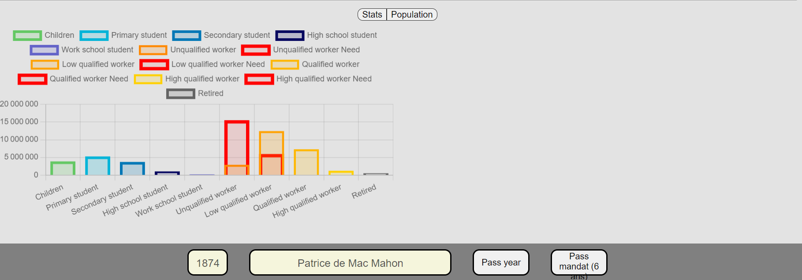
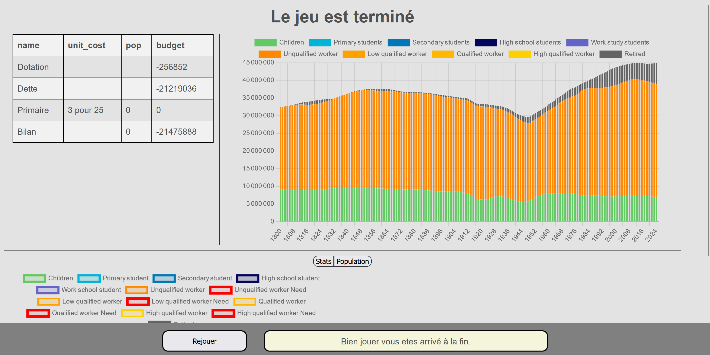

# T4
Nom du groupe : KFC

menbres : Gaël Seiller, Tom Czekaj, Anatole Voltz

lien evaluation T4:
- Lilou : https://git.unistra.fr/-/ide/project/T234/2024/Demography-Simulator/edit/main/-/evaluations/evaluation-Lilou_Choukroun--Balzan.md
- Jules : https://git.unistra.fr/-/ide/project/T234/2024/Demography-Simulator/edit/main/-/evaluations/evaluation-Jules_Klausnitzer.md
- Kilian : https://git.unistra.fr/-/ide/project/T234/2024/Demography-Simulator/edit/main/-/evaluations/evaluation-Kilian_Sakhi.md

# DemoDemo
Un simulateur de démographie

DemoDemo est un démonstrateur de démographie, qui simule une population, avec un certain nombre d'individus par âge. 
Il permet au joueur d'expérimenter diverses politiques éducatives, mesurer les impacts sur la société, et découvrir les enjeux de la massification scolaire.

## présentation du projet
### Ecran de jeu

### Récapitulatif

### Fin du jeu

## Objectifs pédagogiques
Les objectifs pédagogiques sont de permettre au joueur de comprendre :

- Les concepts de massification et de stagnation éducative
  - En augmentant le niveau de qualification de sa population, une civilisation améliore ses performances économiques, mais cette politique connait une limite.
- Le concept de stratification scolaire.
  - En décidant du nombre de places dans le système éducatif, on pilote une stratification scolaire, qui ne correspond pas forcément à la stratification économique.
- Le temps long de l'éducation.
  - le temps qui sépare une décision de ses effets concrets en matière d'éducation peut être très long, et la période de temps qui est engagée par ces décisions encore plus.

### Objectifs pédagogiques avancés 
- L'éducation impacte de nombreux aspects d'une société.
  - En plus de l'économie, la natalité et la mortalité notamment, lesquels impactent à leur tour le système éducatif.
  - Lorsque la population est moins qualifiée que les besoins de l'emploi, il peut y avoir ascencion sociale.
  - Lorsque la population est plus qualifiée que les besoins de l'emploi, il y a déclassement social.
- L'éducation peut se placer dans un contexte de compétition internationale.
  - Monter en qualification peut servir à vaincre sur les plans économiques, technologiques (militaire) ou culturels.
  - Dans un contexte de mondialisation, les sociétés massifiées peuvent abandonner une partie de leurs emplois non qualifiés, ce qui impacte les besoins éducatifs.
- Le temps de l'éducation n'est pas le temps du politique.
  - Impossibilité pour un élu de récolter les fruits d'une réforme dans les 5 ans de son mandat.
- L'éducation peut servir à autre chose que l'insertion professionnelle.
  - Bataille culturelle, Progression technologique, Progression sociale, Stabilité démocratique... Et diminuer le nombre d'actifs (donc de chômeurs).

## Références

- https://fr.wikipedia.org/wiki/D%C3%A9mocratisation_de_l%27enseignement_en_France
- https://www.cairn.info/democratisation-de-l-enseignement--9782707194039.htm
- https://www.cairn.info/revue-le-telemaque-2004-1-page-135.htm
- http://ses.ens-lyon.fr/ressources/stats-a-la-une/massification-et-democratisation-de-lacces-a-lecole-et-a-lenseignement-superieur
- https://journals.openedition.org/sdt/15641
- https://blog.educpros.fr/julien-gossa/2022/02/03/50-ans-de-massification-et-apres/
- https://fr.wikipedia.org/wiki/Démographie_de_la_France#Natalité
- https://www.ined.fr/fr/tout-savoir-population/graphiques-cartes/graphiques-interpretes/esperance-vie-france/
  
## Description des fonctionnalités

### Simulation

Le pas de la simulation est d’un an ou l'on peut passer au prochain dirigent.

- Tous les individus veillissent d'une année ensemble
- Chaque année, un certain nombre d'individus naissent et meurent. 

Les individus sont comptés par statut : enfant, étudiant, puis travailleur et enfin retraité.

- Chaque statut a ses caractéristiques en terme de production et de consommation de richesses.
- A 3 ans, si une place de formation est disponible, un enfant devient étudiant, et reste étudiant tant qu'il reste des places de formation.
- A partir de x ans (10 par défaut), un enfant qui n'est pas étudiant devient un travailleur.
- Un étudiant qui quitte le système éducatif devient un travailleur.
- A partir de x ans (64 par défaut), un travailleur devient retraité.

Le système éducatif est organisé en trois strates : primaine, secondaire et tertaire (supérieur).

- A 3 ans, un enfant peut devenir étudiant dans le primaire, sinon il reste enfant.
- A 10 ans, un enfant devient un travailleur non qualifié.
- A 10 ans, un étudiant peut devenir étudiant dans le secondaire s'il y a une place, sinon il devient travailleur peu qualifié.
- A 18 ans, un étudiant peut devenir étudiant dans le supérieur s'il y a une place, sinon il devient travailleur qualifé.
- A 27 ans, un étudiant devient travailleur très qualifé.
- À chaque fin d'étude un étudiant peut échouer il devient alors un travailleur du niveau inférieur.
- Si un étudiant échoue ses études secondaire, il a une chance d'aller en alternance pour devenir un travailleur qualifié.
- On peut définir un taux de réussite en fin de niveau : seulement x% des étudiants obtiennent la qualification voulut.

Chaque année, un budget nationnal est calculé.

- En fonction de leur statut, les individus produisent un certain nombre de richesses.
  - Plus un individu est qualifié, plus il produit de richesses.
  - Plus un individu occupe un emploi qualifié, plus il produit de richesses.
- En fonction de leur statut, les individus consomment un certain nombre de richesses.
  - Plus un individu occupe un emploi qualifié, plus il consomme de richesses.
- Le surplus est la différence entre la somme des richesses produites et la somme des richesses consommées.
- En fonction de la réduction du PIB, calculer sur les besoin de la nation.
  - Plus un besoin est satisfait, moin le PIB sera réduit.

Chaque année, un budget éducation est calculé.

- Une part du surplus national peut être investie dans l'éducation.
- Cet investissement permet d'ouvrir des places de formation, qui sont automatiquement occupées par les jeunes.
- Les places peuvent être ouvertes à chacun des trois niveaux (primaire, secondaire, tertiaire).
- Chaque place a un coût, qui dépend de son niveau.
- Une nouvelle place ne peut être ouverte que si le budget éducation est suffisant.
- Si le budget n'est pas suffisant, le budget est déficitaire et on ne peut que diminuer le nombre de places.

Les travailleurs peuvent occuper un emploi (fonctionalité avancée)

- Un travailleur occupe en priorité un emploi correspondant à son niveau de qualification.
- Si aucun emploi disponible ne correspond à son niveau de qualification, il occupe un emploi de niveau immédiatement supérieur ou inférieur.
- Sinon il est au chômage.
- Un travailleur occupant un emploi de niveau supérieur est dit sous-qualifié (malus de productivié, bonus de moral), un travailleur occupant un emploi de niveau inférieur est dit surqualifié (bonus de productivité, malus de moral).

### Interface

L'interface est constituée des élements suivants :

- Graphique colonnes présentant le nombre d'individus par statut et par âge.
- Graphique colonnes présentant le nombre d'individus par activité.
- Graphique colonnes comparant la stratification scolaire à la stratification économique (besoin de l'emploi).
- Graphiques ligne permettant de visualiser dans le temps toutes les séries du simulateur.
- Tableau présentant le budget national
- Tableau présentant le budget éducation

### Actions du joueur

Les actions du joueur sont les suivantes :

- Les modifications sont en % d'une classe d'âge.
- Modifier le nombre de places de formation primaire.
- Modifier le taux de réussite de la formation primaire.
- Modifier le nombre de places de formation secondaire.
- Modifier le taux de réussite de la formation secondaire.
- Modifier le nombre de places de formation tertiaire.
- Modifier le taux de réussite de la formation tertiaire. 
- Modifier le taux d'étudiant qui peuvent aller en alternace
- Autres actions : mise en œuvre de différentes politiques avec différents couts et effets (voir fonctionnalités et scénarios avancés)

### Scénario

Le jeu permet de choisir un scenario, qui contient une description et un objectif à atteindre (conditions de victoire).

- Bac à sable : on commence avec une petite société non qualifiée, pas de condition de victoire.
- Atteindre 100% d'éducation tertiaire en moins de x années, sans avoir de déficit budgétaire.
- Arriver au plein emploi dans une société massifiées.
- Arriver au plein emploi dans une société massifiées, dans le temps d'un mandat présidentiel (5 ou 10 ans).

### Modularité

Le code est modularisé, par exemple en suivant le modèle MVC.

Toutes les pondérations (constantes) sont réunies dans un fihier unique.

Chaque scenario est décrit dans un fichier unique.

Les modules suivants peuvent être remplacés dans les scénarios :
- toutes les pondérations
- démographie (naissance et décès)
- statuts (type + règles de modification)
- économie (calcul du nombre d'emplois par strates)

## Fonctionnalités et scénarios avancés

- Scénarios : réforme des retraites ; démographie de l'an 2000 ; données réelles de différentes sociétés.
- Ajouter le genre.
- Espérance de vie et taux de natalité en fonction du niveau de qualification.
- Filière de la formation : en plus du niveau, les formations sont dans des filières professionnalisantes (inertion pro et pas de poursuite d'étude) ou non-professionalisantes (poursuite d'étude ou travailleur non qualifiés).
- Alternance : ajouter plusieur type d'alternance (au secondaire).
- Qualité de la formation : en plus du niveau, la formation a également une qualité, qui le joueur peut faire varier, par exemple avec budget exédentaire ou bénéficiaire, des politiques d'inclusion ou de réussite, etc.
- Ajouter la notion de qualification incomplète : pour chaque niveau de qualification, l'individu peut l'avoir en complet (réussite à l'examen) ou incomplet (abandon ou échec).
- Ajouter un découpage du niveau de qualification plus avancé: secondaire = collège + lycée ; tertaire = Licence + Master + Doctorat.
- Ajouter des rentiers : ils ne produisent rien mais consomment beaucoup.
- Ajouter la formation continue des adultes.
- Permettre de modifier la part du surplus de richesses affectée à l'éducation, par exemple s'il y a croissance économique.
- PvP ou PvE (avec concurrents IA)
- Ajouter la possibilité d'importer de la production, si budget de l'éducation n'est pas négatif.
- Ajouter la possibilité de perdre de différente façons
- Les travailleurs peuvent occuper un emploi (fonctionalité avancée)
  - Un travailleur occupe en priorité un emploi correspondant à son niveau de qualification.
  - Si aucun emploi disponible ne correspond à son niveau de qualification, il occupe un emploi de niveau immédiatement supérieur ou inférieur.
  - Sinon il est au chômage.
  - Un travailleur occupant un emploi de niveau supérieur est dit sous-qualifié (malus de productivié, bonus de moral), un travailleur occupant un emploi de niveau inférieur est dit surqualifié (bonus de productivité, malus de moral).
- Ajouter la modularité